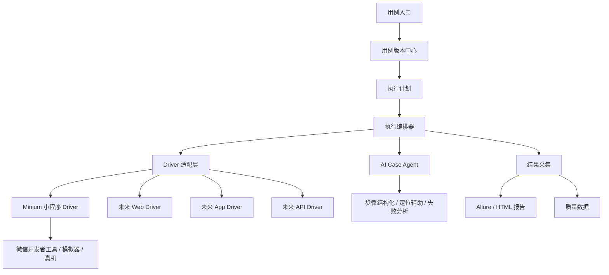
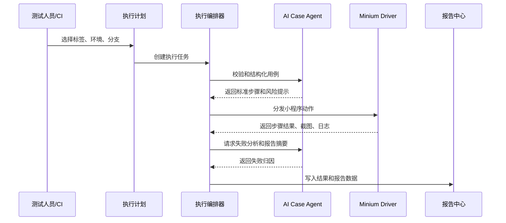

# 小程序 UI 自动化回归平台一期设计

## 背景

当前团队希望以小程序 UI 自动化作为首个落地场景，验证 AI 辅助执行、用例编写、版本管理、定时执行和可视化报告的完整闭环。虽然一期只接入小程序，但架构需要预留全平台推广能力，后续可以扩展到 Web、App、接口、桌面端和混合端场景。

本设计采用“平台主干 + Driver 插件”的方式：平台层负责用例资产、执行编排、AI 能力、报告和质量数据；小程序侧通过 Minium Driver 接入，避免把平台能力绑定死在单一小程序框架上。

## 目标

一期目标是建立可推广的最小平台闭环，而不是只写一批小程序脚本。

- 支持小程序 UI 自动化用例编写、存储和版本管理。
- 支持基于 Minium 的小程序自动化执行。
- 支持自然语言用例到结构化步骤的 AI 辅助转换。
- 支持定时执行、手动执行和按标签执行。
- 支持截图、日志、失败原因和 HTML/Allure 可视化报告。
- 预留统一 Driver 协议，后续可扩展 Web、App、接口等端。

## 非目标

一期不建设完整企业级测试平台的全部能力。

- 不做复杂权限体系，只保留角色和负责人字段。
- 不做完整设备云，只保留设备配置抽象。
- 不做跨项目大盘，只输出单项目报告和可扩展数据模型。
- 不做完全自主探索式 AI 测试，AI 以辅助生成、执行解释和失败分析为主。

## 总体架构



平台分为五层：

1. 用例资产层：管理自然语言用例、结构化 DSL、测试数据、标签、优先级和版本。
2. 执行编排层：负责选择用例、分发任务、调度 Driver、重试和收集结果。
3. AI 能力层：负责用例结构化、步骤解释、元素定位辅助、失败归因和报告摘要。
4. Driver 适配层：一期接 Minium，后续扩展 Playwright、Appium、API Driver。
5. 报告与质量层：输出单次报告、失败明细、截图、日志和趋势数据。

## 一期技术选型

| 模块 | 选型 | 说明 |
| --- | --- | --- |
| 小程序执行 | Minium | 小程序 UI 自动化首选 Driver，支持页面操作、数据注入、Hook/Mock 等能力 |
| 用例格式 | YAML + JSON Schema | 测试人员可读，执行器可校验 |
| 执行语言 | Python 优先 | 与 Minium 生态贴合，后续可通过 HTTP/CLI 接入其他 Driver |
| 报告 | Allure + 自定义摘要 JSON | Allure 负责可视化，自定义 JSON 负责平台化沉淀 |
| 调度 | CI 定时任务优先 | 先通过 Jenkins/GitHub Actions/GitLab CI 形成闭环 |
| AI Agent | 独立执行辅助模块 | 不直接替代 Driver，只做步骤生成、定位建议和失败分析 |

## 目录结构

```text
miniapp-ui-auto/
  cases/
    smoke/
    regression/
  schemas/
    case.schema.json
  data/
    env/
    users/
  drivers/
    base/
    minium/
  runner/
    case_loader.py
    scheduler.py
    executor.py
    result_collector.py
  ai/
    prompts/
    case_normalizer.md
    failure_analyzer.md
    locator_helper.md
  reports/
    allure-results/
    summary/
  config/
    env.yaml
    minium.yaml
    schedule.yaml
  docs/
```

当前仓库可以先将该测试工程作为子目录引入；如果后续推广到多项目，建议独立成平台仓库，并让各业务项目只维护自己的用例包。

## 用例模型

用例分为自然语言描述和可执行 DSL 两种形态。测试同学可以优先编写业务可读 YAML，AI Agent 负责辅助转换和校验。

```yaml
id: miniapp_login_001
title: 手机号验证码登录成功
platform: miniapp
driver: minium
module: login
priority: P0
tags:
  - smoke
  - regression
owner: qa
version: 1
preconditions:
  - 已配置测试环境
  - 验证码服务使用固定验证码
steps:
  - action: open_page
    target: pages/index/index
  - action: tap
    target: 我的
  - action: tap
    target: 登录
  - action: input
    target: 手机号输入框
    value: "13800000000"
  - action: input
    target: 验证码输入框
    value: "123456"
  - action: tap
    target: 确认登录
assertions:
  - type: text
    target: 用户昵称
    expected: visible
  - type: api
    target: login
    expected: success
```

Driver 不直接消费自然语言，而是消费标准动作协议。这样后续新增 Web 或 App Driver 时，可以复用大部分用例资产。

## 统一动作协议

一期先支持小程序回归高频动作。

| 动作 | 说明 |
| --- | --- |
| open_page | 打开小程序页面 |
| tap | 点击元素 |
| input | 输入文本 |
| wait | 等待页面、元素或接口状态 |
| assert_text | 断言文本展示 |
| assert_element | 断言元素存在、可见或不可见 |
| assert_data | 断言页面数据或状态 |
| screenshot | 主动截图 |
| mock | 设置接口或 wx 能力 Mock |
| set_storage | 设置登录态或本地缓存 |

Minium Driver 负责把这些动作翻译成 Minium API 调用。平台上层只感知动作协议，不感知 Minium 细节。

## AI Agent 设计

AI Agent 一期承担四类能力：

1. 用例结构化：将业务自然语言步骤转换为标准 DSL，并提示缺失的前置条件、测试数据和断言。
2. 定位辅助：当目标元素无法定位时，结合页面结构、截图、历史选择器和同义词生成候选定位策略。
3. 失败分析：读取执行日志、截图、断言信息和接口摘要，输出失败分类和建议。
4. 报告摘要：将执行结果总结为业务可读的回归结论。

AI Agent 不直接绕过 Driver 操作页面，所有真实执行动作必须经过 Driver 适配层，以保证可审计、可回放和可稳定调试。

## Minium Driver 边界

Minium Driver 是小程序一期的核心执行插件，职责包括：

- 启动并连接微信开发者工具、小程序项目、模拟器或真机。
- 打开指定页面并执行 tap、input、wait、assert 等标准动作。
- 支持小程序页面数据读取、storage 设置、mock 和 hook 能力。
- 采集截图、页面路径、控制台日志和失败上下文。
- 将 Minium 异常统一转换为平台执行错误码。

Minium Driver 不负责：

- 管理用例版本。
- 决定执行计划。
- 生成 AI 分析结论。
- 直接输出平台报告。

## 执行流程



## 报告设计

一期报告包含两类输出：

- Allure 报告：面向测试和研发排查，展示步骤、截图、日志、失败堆栈。
- Summary JSON：面向后续平台化沉淀，记录用例、环境、耗时、失败类型和 AI 结论。

报告字段包括：

- 执行 ID、分支、commit、环境、触发方式。
- 用例总数、通过数、失败数、跳过数、通过率。
- 失败用例 ID、模块、优先级、截图、日志。
- AI 失败分类：脚本问题、环境问题、数据问题、功能缺陷、疑似 flaky。
- AI 摘要：本次回归整体结论和建议优先处理项。

## 调度设计

一期优先接 CI 调度，降低平台建设成本。

- 每次主分支合并后执行 P0 冒烟。
- 每晚定时执行 P0/P1 回归。
- 发版前手动触发全量回归。
- 支持按 tag、module、priority 过滤用例。

后续平台化后，CI 只负责触发，执行计划和队列由平台调度中心管理。

## 可扩展设计

后续推广全平台时，新增 Driver 即可扩展端能力。

| 平台 | Driver |
| --- | --- |
| 小程序 | Minium Driver |
| Web/H5 | Playwright Driver |
| 原生 App | Appium Driver |
| 接口 | API Driver |
| 桌面端 | WinAppDriver/Electron Driver |

所有 Driver 统一实现以下接口：

```text
setup(context)
execute_step(step)
capture_artifact()
teardown()
```

## 风险与应对

| 风险 | 应对 |
| --- | --- |
| 小程序元素定位不稳定 | 建立页面对象、语义 target 映射和 AI 候选定位 |
| 登录态和测试数据不稳定 | 使用 storage 注入、固定验证码、测试账号池和接口准备数据 |
| Minium 环境依赖复杂 | 固化微信开发者工具版本、配置检查脚本和执行前健康检查 |
| AI 输出不可控 | AI 只生成建议和结构化步骤，执行前做 Schema 校验 |
| 后续多端扩展困难 | 一期就抽象统一动作协议和 Driver 接口 |

## 分阶段路线

### 阶段 1：小程序闭环

- 建立用例 YAML 和 Schema。
- 接入 Minium Driver。
- 支持 P0 冒烟用例执行。
- 输出 Allure 报告和 Summary JSON。
- 支持 CI 定时执行。

### 阶段 2：AI 辅助增强

- 支持自然语言 case 转 DSL。
- 支持失败日志和截图分析。
- 支持元素定位候选建议。
- 支持报告自动摘要。

### 阶段 3：多端扩展

- 接入 Playwright Web Driver。
- 接入 API Driver。
- 支持多端混合用例和统一报告。

### 阶段 4：平台化推广

- 建设 Web 用例入口。
- 建设测试计划、执行队列和历史趋势。
- 接入项目、需求、缺陷和流水线。
- 支持组织级质量看板。

## 验收标准

一期完成后应满足：

- 能在 Git 中维护小程序 YAML 用例。
- 能通过命令行或 CI 选择 P0 冒烟并执行。
- 能基于 Minium 驱动小程序完成至少一条登录或核心链路用例。
- 能生成包含步骤、截图、日志和失败原因的报告。
- 能输出 AI 失败摘要。
- 新增 Web/App/API Driver 时不需要重写用例管理和报告中心。
